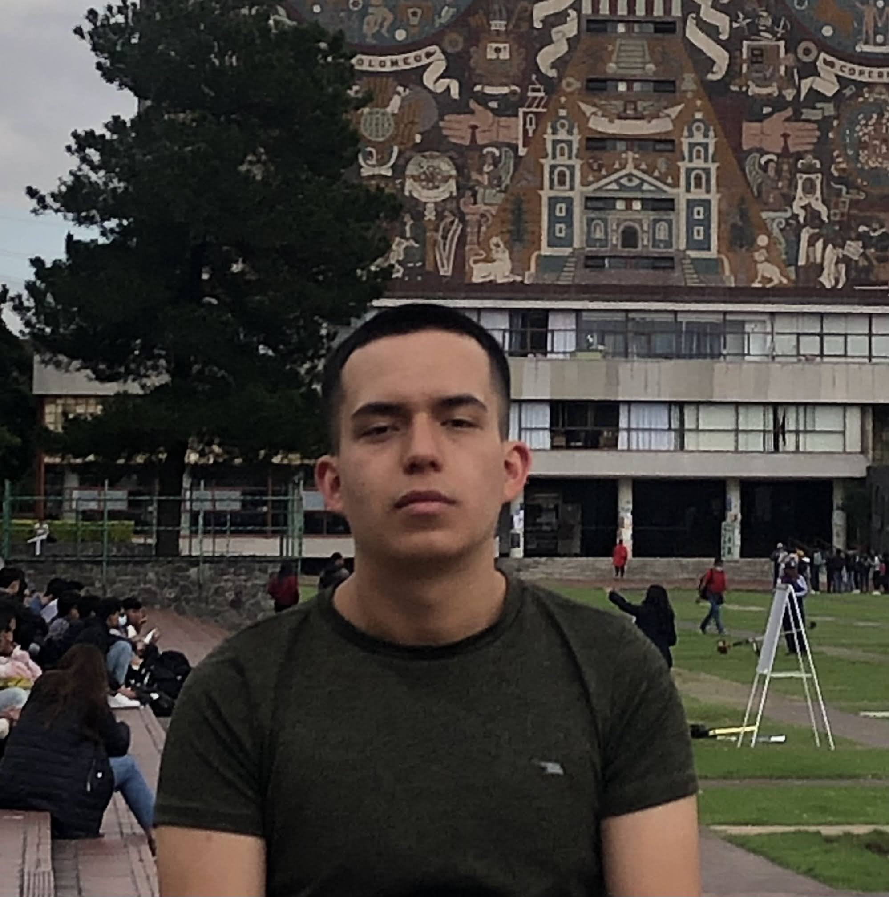

# Cesar Bautista 
### Software Engineer | Full Stack Developer | Computer Engineering @ UNAM

  
   
  

    <b>Ingeniero de Software especializado en arquitecturas escalables y alto rendimiento.</b>
  

---

## 🚀 Proyectos Destacados

### 🟢 [Latager](https://latager.com)
Solución integral de planeación académica que optimiza la experiencia de **+3,500 estudiantes** en la UNAM. Arquitectura robusta con sincronización en tiempo real.

### 🟢 [Hexacode](https://mmedia1.fi-b.unam.mx/hexacode/)
IDE especializado en la enseñanza de arquitectura z80/8086 con motor lógico en **Lua** sobre un entorno web fluido.

### 🟢 [Módulo QSP](https://plagasqsp.com/)
Digitalización de procesos operativos y auditorías industriales para el sector de control de plagas avanzado.

---

## 🛠️ Stack Tecnológico

- **Backend:** Python (Django, DRF), Lua.
- **Frontend:** React, JavaScript, CSS (Apple Design System).
- **Herramientas:** Docker, PostgreSQL, MySQL.
- **Low-Level:** Assembler (z80/8086).

---

## 🎓 Educación & Experiencia

- **UNAM (Facultad de Ingeniería):** Ingeniería en Computación (2022 - 2027).
- **Lab Multimedia UNAM:** Director de Proyecto & Lead Full Stack.
- **Quality & Pest Control:** Full Stack Engineer.

---

## 📬 Contacto Directo

Si buscas resultados técnicos de alto impacto, hablemos:

📧 **Email:** [bautistac.cesar.p8@gmail.com](mailto:bautistac.cesar.p8@gmail.com)  
📱 **WhatsApp:** [+52 55 3016 4627](tel:+525530164627)  
🔗 **LinkedIn:** [linkedin.com/in/cesbaut](https://linkedin.com/in/cesbaut)

---

  Generated with  Apple Pro Design System

